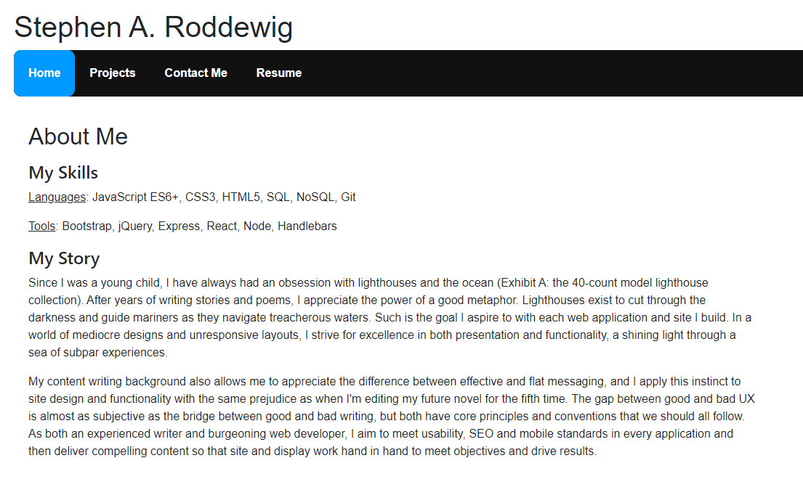
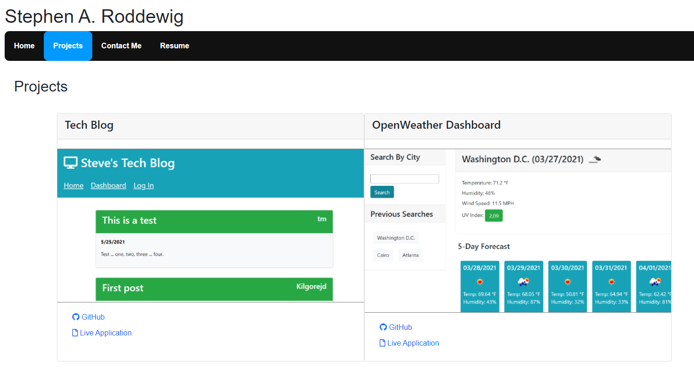
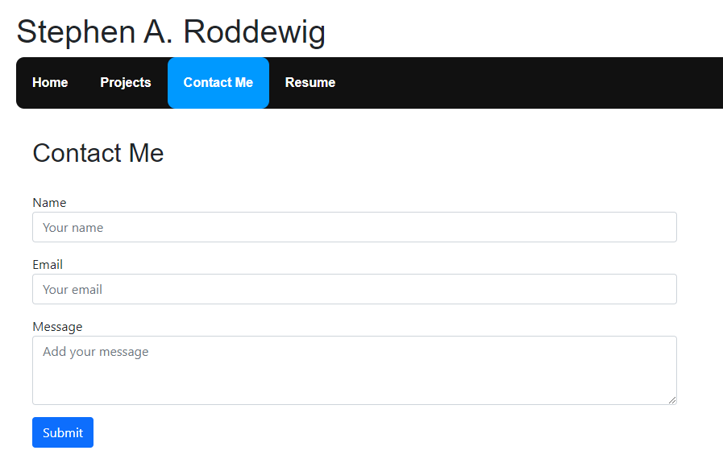

# React Portfolio App


## Table of Contents
- [Project Overview](#project-overview) 
- [Live Application](#live-application)
- [Installation](#installation)
- [License](#license)
- [Screenshots](#screenshots)

## Project Overview
Simple client-side portfolio application built using React.js to display latest work samples with dynamically rendered HTML. Bootstrap and custom CSS are applied to achieve responsiveness across screen sizes. React Router is used to render page components and change URL to match without reloading page.

[View the live application](https://captain63.github.io/portfolio-react-app).

### Languages Used
- JavaScript (React)
- HTML
- CSS

### Node Libraries Used
- [React](https://www.npmjs.com/package/react)
- [React DOM](https://www.npmjs.com/package/react-router-dom)

See [package.json](./package.json) for full list of dependencies.

### Additional Libraries
- [Bootstrap](https://www.npmjs.com/package/bootstrap)
- [Font Awesome](https://fontawesome.com)

## Live Application
[View the live application](https://captain63.github.io/portfolio-react-app).

## Installation
To run this application on your local machine, Node.js is _required_. Once cloned/downloaded from GitHub, enter ```npm i``` in command line to install the packages referenced under Libraries Used automatically. You are now be ready to launch the application by entering ```npm start```.

## License
Permission is hereby granted, free of charge, to any person obtaining a copy of this Software and associated documentation files (the "Software"), to deal in the Software without  restriction, including without limitation the rights to use, copy, modify, merge, publish distribute, sublicense, and/or sell copies of the Software, and to permit persons to whom the Software is furnished to do so, subject to the following conditions.

[View the full license](./LICENSE)

## Screenshots





